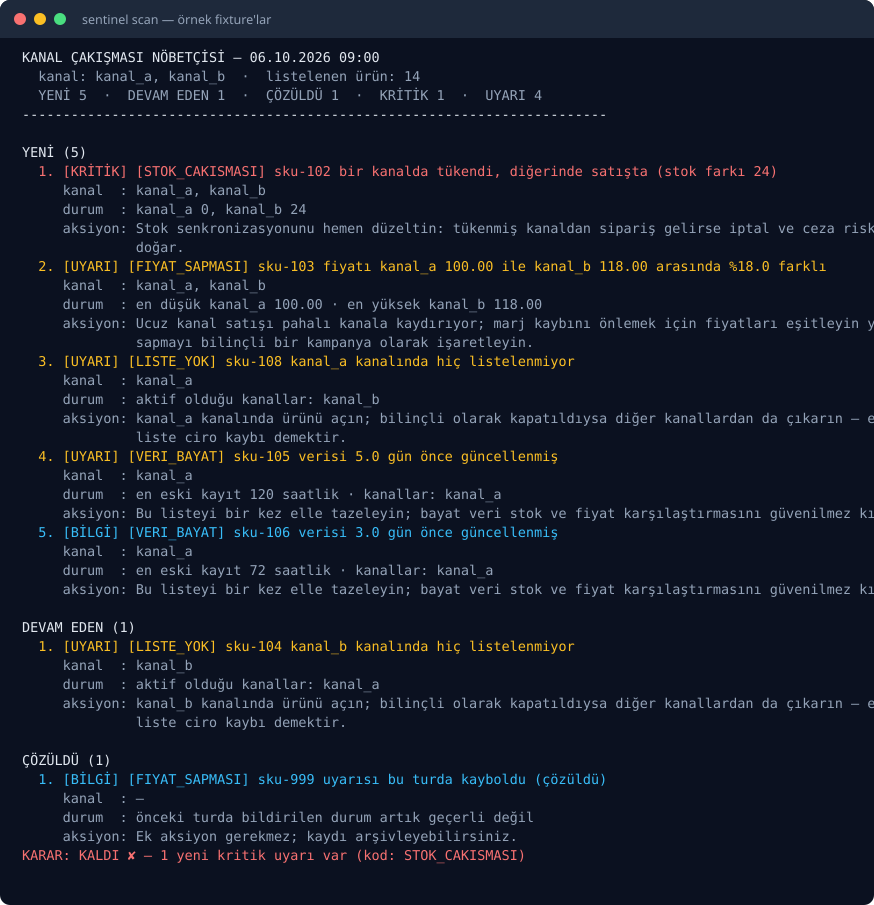

# marketplace-sentinel

[](https://github.com/acar32furkan-glitch/marketplace-sentinel/actions/workflows/ci.yml)
[](https://www.python.org/)
[](LICENSE)
[](https://docs.astral.sh/ruff/)
[](https://mypy-lang.org/)

[Türkçe](README.md) · **English**

**A deterministic sentinel for merchants selling the same product on several marketplaces.** It
catches stock/price inconsistencies for the same merchant `sku` across channels, products that were
never listed in a channel, and stale data — and reports **only new and ongoing alerts**, silently
closing the ones that were fixed.

No credentials, no network, see it in 30 seconds:

```bash
git clone https://github.com/acar32furkan-glitch/marketplace-sentinel && cd marketplace-sentinel
uv sync --all-extras --dev
uv run sentinel scan --fixtures examples/data --no-state-write
```

> `--no-state-write` is only used for the demo: the bundled state file (`examples/data/state.json`)
> stays untouched, so the NEW / ONGOING / RESOLVED split is identical on every run. Real runs do
> write state.



> Alert messages and docs are Turkish on purpose: the people reading the report are the store
> operations team. Code, field names, rule identifiers and CLI flags are English.

---

## Why

When the same product is sold on five marketplaces there are five truths. Stock drops to 0 on
Trendyol while Hepsiburada still shows 12; a campaign cuts the price by 40% on one channel and the
others keep the old number; a newly opened channel never got the product listed and nobody noticed.
These inconsistencies look normal on the page; the customer finds them first — or never, and you
just lose the sale.

marketplace-sentinel makes them **visible in one command, reproducibly**:

- **No network, no LLM, injected clock.** The same input plus the same `--now` always produces the
  same alerts; the result is CI-trustworthy (see [ADR-0001](docs/adr/0001-profile-driven-adapters.md)).
- **No alert storm.** An alert state file (`state.json`) is kept; the sentinel does not shout the
  same problem on every run — it reports only the **NEW**, **ONGOING** and **RESOLVED**
  distinction (see [ADR-0002](docs/adr/0002-alert-state-and-dedup.md)).
- **A new marketplace is YAML.** Adding a channel is writing a profile file, not changing code; the
  same rule engine applies to every channel (see [ADR-0001](docs/adr/0001-profile-driven-adapters.md)).

## Four rules

| Code | What it catches | Severity | Default threshold |
|------|-----------------|----------|-------------------|
| `STOK_CAKISMASI` | Cross-channel stock gap for the same sku | WARNING · CRITICAL if one channel shows 0 and another ≥10 | gap > 5 units |
| `FIYAT_SAPMASI` | Cross-channel price gap for the same sku | WARNING · CRITICAL if the price doubles (≥100%) | gap > 5% |
| `LISTE_YOK` | A product never listed in a channel that returned data | WARNING | present in ≥1 channel, absent in another |
| `VERI_BAYAT` | Channel data has aged | INFO · WARNING at ≥96 h | data age > 48 hours |

Rule codes, thresholds and their rationale: **[docs/rules.md](docs/rules.md)** (Turkish).

```bash
uv run sentinel profiles --fixtures examples/data           # active channels and field mapping
uv run sentinel scan --fixtures examples/data --json        # the JSON contract for agents/CI
uv run sentinel state show --state examples/data/state.json
uv run sentinel watch --fixtures examples/data --interval 900 --iterations 2
```

## Exit codes

| Code | Meaning |
|------|---------|
| `0` | No new critical alerts (policy satisfied) |
| `1` | `--fail-on` policy failed (default `new-critical`) |
| `2` | Input error (broken profile, unreadable fixture, invalid state file) |

`--fail-on` choices: `none` · `new-critical` (default) · `any-new`.

## Using it in CI

```yaml
- name: Marketplace watch
  run: uv run sentinel scan --fixtures content/data --fail-on new-critical --github-summary
```

`--github-summary` appends a Markdown report to the Actions job summary; the command exits **1**
when the policy fails, breaking the PR. Example workflow:

```yaml
name: Sentinel
on:
  schedule:
    - cron: "0 */6 * * *"   # a watch every 6 hours
  workflow_dispatch:

jobs:
  watch:
    runs-on: ubuntu-latest
    steps:
      - uses: actions/checkout@v4
      - uses: astral-sh/setup-uv@v5
        with:
          enable-cache: true
      - run: uv sync --all-extras --dev
      - name: Sentinel scan
        run: >
          uv run sentinel scan --fixtures content/data
          --fail-on new-critical --github-summary
```

## State and dedup

Every alert gets a **signature** of the form `code:sku` (example: `STOK_CAKISMASI:sku-102`). The
state file carries the previous run's alerts, so:

- **NEW** — the signature is seen for the first time (reported).
- **ONGOING** — the signature is still open and still valid (summarised, not shouted again).
- **RESOLVED** — it was open in the previous run and is gone now (a closing note).

The state file is human-readable JSON; `--no-state-write` disables writing it.

## Architecture

```text
examples/data/profiles/*.yaml  ─┐
examples/data/*.json (fixtures) ├─→ channels/ ─→ rules.py ─→ scan.py ─→ Alert│State ─→ render/cli
state.json (previous run)      ─┘   (adapters)   (pure)     (dedup)
```

- The rule and measurement layer is a **pure function**: no IO, no clock, no randomness.
- The channel layer is a plugin: `profiles/*.yaml` carries the field mapping and auth style as data.
- `scan.py` runs the measurement **independently of the network**; input may come from a fixture or a
  real client, and the rule engine cannot tell them apart.
- Details: [docs/architecture.md](docs/architecture.md) · decisions: [docs/adr/](docs/adr/)

## Quality

```bash
uv run ruff check . && uv run ruff format --check .
uv run mypy                              # strict
uv run pytest --cov=sentinel --cov-report=term-missing --cov-fail-under=85
uv run python scripts/verify_examples.py  # sample data ↔ profile consistency
```

**149 tests** · **97.9% coverage** · `ruff` + `ruff format` + `mypy --strict` clean · CI: Python 3.12
and 3.13 matrix plus a "sentinel demo" job (JSON contract, exit code and job summary are asserted).
The interpreter that CI actually installs is verified inside the job, so a matrix entry running the
wrong Python turns red instead of passing silently.

## Limits

- **It does not write to a marketplace.** It does not update price/stock; it only reads and reports
  (out of scope, deliberately).
- **It does not scrape panels.** Data comes from an official marketplace API or from fixtures you
  provide.
- **No LLM.** It does not judge meaning or content, only numeric and temporal inconsistencies.
- **The rule engine is channel-agnostic:** a new marketplace is a YAML file under `profiles/`, not
  code.

## Contributing

[CONTRIBUTING.md](CONTRIBUTING.md) · [CODE_OF_CONDUCT.md](CODE_OF_CONDUCT.md) ·
[SECURITY.md](SECURITY.md) · changes: [CHANGELOG.md](CHANGELOG.md)

## License

[MIT](LICENSE) © 2026 acar32furkan-glitch
