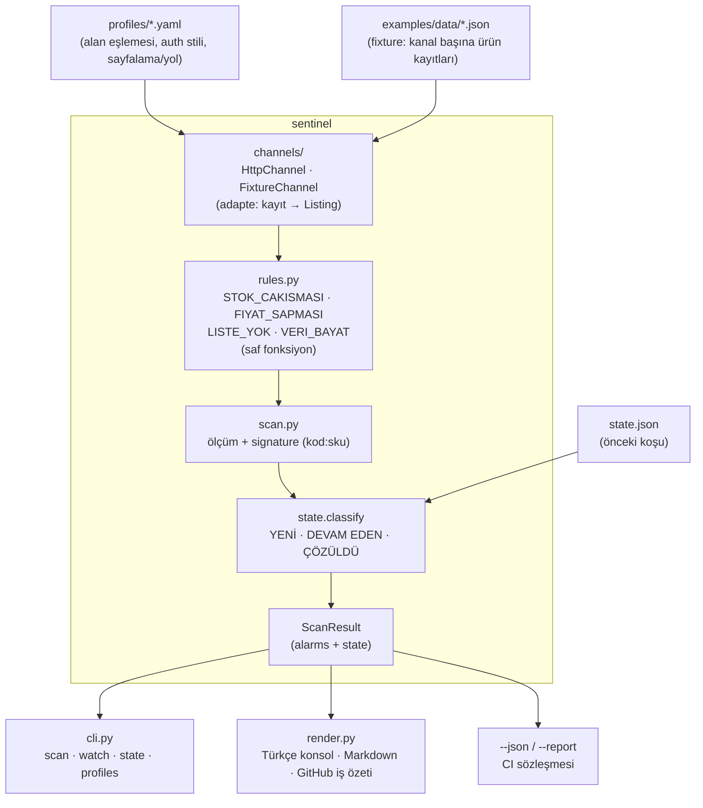

# Mimari

Dört katman, tek yönlü akış: **girdi (profil + fixture) → kanallar → kurallar → dedupe → çıktı**.
Hiçbir katman ağa çıkmaz, saati okumaz veya rastgelelik kullanmaz (`now` dışarıdan verilir); bu
yüzden aynı girdi + aynı durum her zaman aynı alarmları üretir.



## Katmanlar

| Modül | Sorumluluk | Notlar |
|-------|-----------|--------|
| `profiles.py` | Pazaryeri profilini (`*.yaml`) yükler ve doğrular | Bilinmeyen alan reddedilir (yazım hatası koruması) |
| `channels/` | Profil + kaynak veriyi okur, kanonik listeye (`Listing`) çevirir | Alan eşlemesi veridir; kanal mantığı profilden gelir |
| `rules.py` | Dört bağımsız kural | Her kural `RuleContext` alır, `RuleOutcome` döndürür; saf fonksiyon |
| `scan.py` | Kuralları çalıştırır, alarmları üretir ve `kod:sku` imzası atar | Girdiyi fixture/istemci ayırt etmez |
| `state.py` | `state.json` okur, imzaları sınıflar | `classify()` → YENİ / DEVAM EDEN / ÇÖZÜLDÜ |
| `render.py` | İnsan tarafı çıktı | Türkçe konsol, Markdown, Actions iş özeti |
| `cli.py` | Komutlar ve çıkış kodları | `0` yeni kritik yok · `1` politika düştü · `2` girdi hatası |

## Neden ayrı bir `channels/` katmanı?

Kural motoru **kanal-agnostiktir**: `STOK_CAKISMASI` çalışırken kaydın Trendyol'dan mı Hepsiburada'dan
mı geldiğini bilmez, yalnızca `Listing(marketplace, sku, title, price, stock, active, updated_at)`
görür. Bu ayrım iki şeyi çözer:

1. **Ölçüm, veri kaynağından bağımsızdır.** Aynı fixture ile testler ve demo çalışır; gerçek API
   istemcisi geldiğinde kural motoru hiç değişmez (bkz. [ADR-0001](adr/0001-profile-driven-adapters.md)).
2. **Yeni kanal kod değildir.** Alan adları farklıysa (`sellingPrice` vs `price`) bu fark profilin
   `mapping` bölümünde veri olarak taşınır; yeni kanal için kod yazılmaz.

## İmza (signature) ve durum makinesi

Her alarm deterministik bir imzayla kimliklenir: `kod:sku` (örnek: `STOK_CAKISMASI:TRN-1001`). İmza;
kural kodunu ve sku'yu birleştirir, böylece bir sorunun **farklı koşularda aynı sorun** olduğu
anlaşılır ve tekrar bildirilmez. Durum geçişleri `state.classify()` içindedir (bkz.
[ADR-0002](adr/0002-alert-state-and-dedup.md)).

```text
önceki durumda yok  + şimdi var      → YENİ
önceki durumda var  + şimdi var      → DEVAM EDEN
önceki durumda var  + şimdi yok      → ÇÖZÜLDÜ
önceki durumda yok  + şimdi yok      → (alarm yok)
```

## Determinizm garantisi

- Zaman `now` parametresiyle dışarıdan verilir; `VERI_BAYAT` gibi kurallar bu yüzden `now` alır.
- Alarm sırası `(önem, kod, sku)` ile sabitlenir; dict sırasına bağlı çıktı yoktur.
- Durum dosyası girdi ve çıktıdır; nöbetçi hiçbir durumu bellekte taşımaz.
- Tüm bu davranışlar `tests/` içinde determinizm sözleşmesi olarak sabitlenmiştir.

## Genişletme noktaları

1. **Yeni pazaryeri:** `examples/data/profiles/` altına bir YAML kopyalayıp `field_map`, `auth` ve
   sayfalama/yol alanlarını düzenle. Kod değişmez.
2. **Yeni kural:** `rules.py` içine saf bir fonksiyon ekle, kod ve önem ata, eşiği `Thresholds`e ekle,
   test + doküman güncelle (adımlar: [CONTRIBUTING.md](../CONTRIBUTING.md)).
3. **CI'ya bağlama:** `sentinel scan ... --json --report out.json` çıktısını kendi panonuza besleyin;
   sözleşme testlerle sabitlenmiştir.
